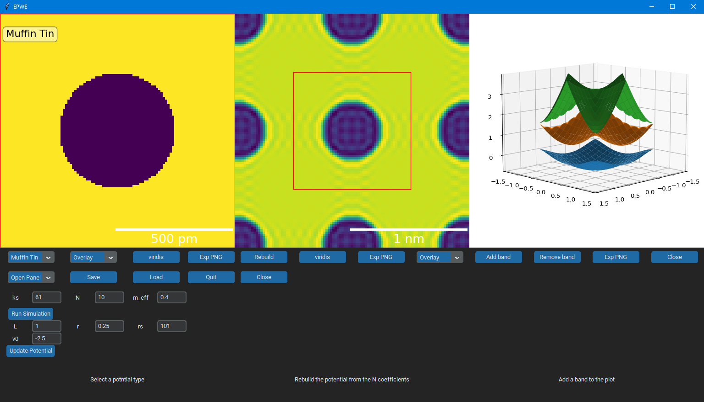

# Central-Equation-Solver
This program solves the 2D TISE with a periodic potential 

# Installation
clone the repository and run 'pip install .' from the root directory

To run: python gui.py

# Usage
There are a number of panels in the gui, each with a specific function. See below figures for some examples. Hovering over buttons in the GUI will also provide help. Sessions can be saved and loaded via '.epwe' files so you can pick up where you left off.

## 1. Setup and run

 1. Choose a potential using the dropdown menu
 2. Adjust the simulation parameters
     - ks = k-space sampling
     - N  = Number of Fourier coefficients
     - m_eff = effective electron mass ratio m*/m
 3. Adjust the parameters that define the periodic potential, then click 'Update Potential'
 4. Click 'Run Simulation'
 5. Recommend viewing the reconstructed potential in the 'Rebuilt Potential' panel to check if N is sufficient

## 2. Generate and view energy maps

  1. Open the 'Map Generator' panel
  2. Use the prev/reset/next band buttons to autofill energy windows to a specific band
  3. Adjust the energy window for the map using Emin and Emax
  4. Click Run - Each map is saved and can be viewed in the 'Map Viewer' Panel

## 3. Generate LDOS curves

 1. Open the 'LDOS' panel
 2. Click 'Add LDOS' to place a marker on the potential map
 3. Use Emin and Emax to adjust the energy range and dE for energy broadening (pts = points along the curve)
 4. Click Run
 5. Use the slider to smooth generated curves

## 4. Save/Load session
 1. Sessions can be saved and loaded
 2. Note: file sizes can become large depending on ks and N parameters
