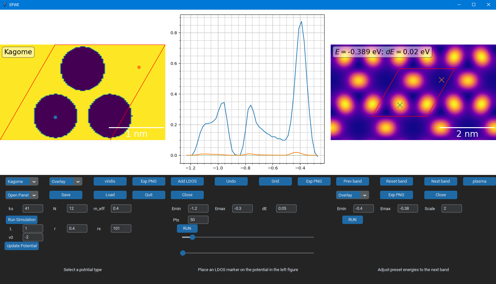

# Central-Equation-Solver
This program solves the 2D TISE with a periodic potential 

# Installation
clone the repository and run 'pip install .' from the root directory

To run: python gui.py

# Usage
There are a number of panels in the gui, each with a specific function. See below figures for some examples. Hovering over buttons in the GUI will also provide help. Sessions can be saved and loaded via '.epwe' files so you can pick up where you left off.

* Select a preset potential type (easy to add your own in potentials.py)
* Adjust simulation parameters
  * ks = k-space sampling
  * N  = Number of Fourier terms
  * m_eff = effective electron mass
* Generate energy maps
* Extract LDOS curves
* View band structure
* Save and load generated maps and LDOS curves
